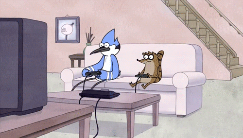
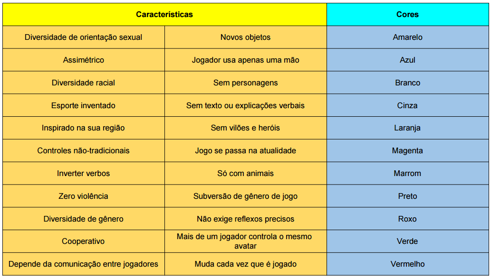

# Introdução ao game design digital

## Discussão

#### O que muda do design de jogo analógico para o digital?

#### Quais são os principais potenciais do computador como suporte?

#### Em quais contextos jogamos videogames?

#### Quais são as expectativas em torno de um jogo digital?

## Exercício de geração de ideias

A partir das características e cores listadas abaixo, vamos tentar criar ideias de jogo rapidamente.

Se quiser imprimir a ficha para ideação de game design macro para usar em casa, o link está [aqui](../materiais/gd-macro.pdf).
