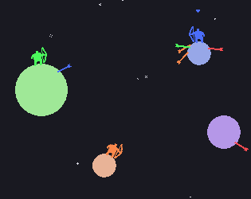
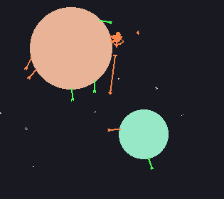
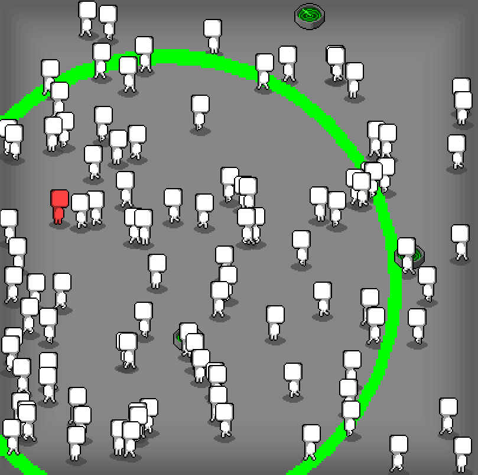

# Recomendações

### [Regular Human Basketball](https://powerhoof.itch.io/regular-human-basketball)

Jogo que explora humor, esporte e a ideia de controle de uma forma inusitada e caótica. Mais infos, [aqui](https://powerhoof.itch.io/regular-human-basketball).

### [Sagittarius](https://gprosser.itch.io/sagittarius)

Jogo multiplayer local para 2 a 5 jogadores. Poucas regras, poucas interações, mas muitas possibilidades de partidas, explorando a complexidade das regras de movimento gravitacional.

### [In the crowd](https://rosden.itch.io/in-the-crowd)

Jogo multiplayer local para até 6 jogadores, em que o objetivo é atacar os outros jogadores enquanto se esconde numa multidão de NPCs. A premissa é simples e o jogo permite uma série de estratégias e reviravoltas.
